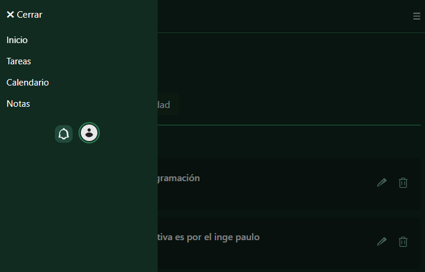
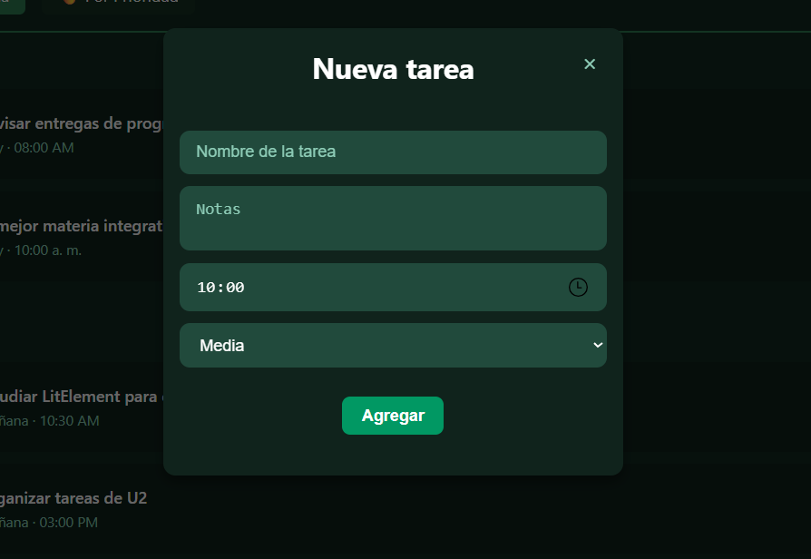
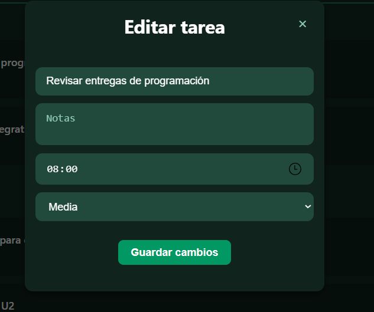
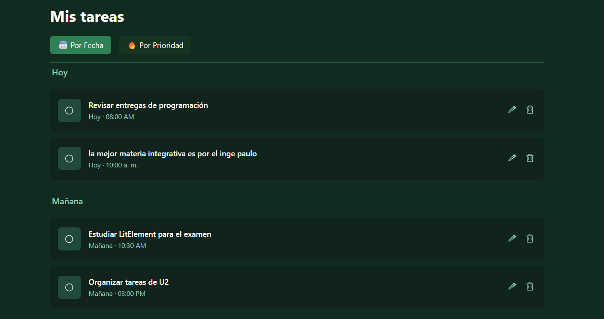
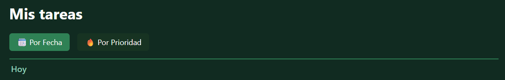
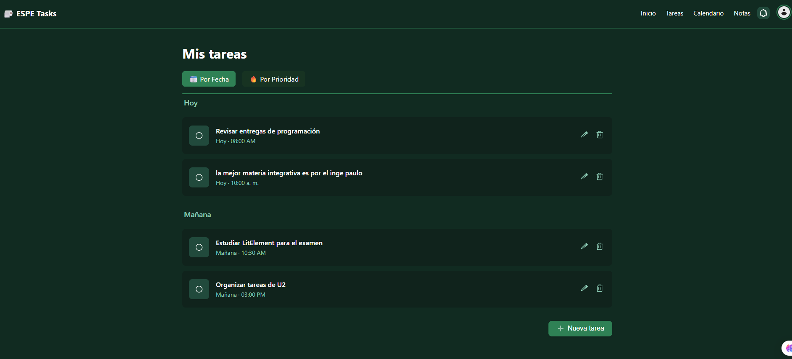

# 🧩 LAB1_U2 - Sistema de Gestión de Tareas con LitElement

Este proyecto es una aplicación de **gestión de tareas (To-Do List)** desarrollada con **LitElement** y **TypeScript**, como parte del laboratorio de la Unidad 2. Se compone de diversos componentes reutilizables que permiten agregar, editar, eliminar y visualizar tareas de forma ordenada, usando una interfaz moderna y modular.

## 📁 Estructura del proyecto

```bash
src/
├── components/
│   ├── layout/           # Componentes de estructura general
│   │   ├── header-component.ts
│   │   ├── nav-menu.ts
│   │   └── sidebar.ts
│   ├── shared/           # Componentes reutilizables compartidos
│   │   ├── add-task-button.ts
│   │   ├── add-task-modal.ts
│   │   ├── icon-bell.ts
│   │   └── user-avatar.ts
│   ├── tasks/            # Componentes relacionados a la gestión de tareas
│   │   ├── task-item.ts
│   │   ├── task-section.ts
│   │   ├── task-tab.ts
│   │   └── task-view.ts
├── styles/
│   ├── variables.css     # Variables de color y diseño global
│   └── app.ts            # Estilos generales de la app
├── types/
│   └── task.ts           # Interfaces de tipos
├── utils/
│   └── formatter.ts      # Utilidades de formateo
├── index.html            # Archivo HTML principal
├── app.ts                # Punto de entrada de la aplicación
```

## 🚀 ¿Cómo ejecutar el proyecto?

1. Clona el repositorio:

```bash
git clone https://github.com/tu-usuario/LAB1_U2.git
cd LAB1_U2
```

2. Instala las dependencias:

```bash
npm install
```

3. Inicia el servidor de desarrollo:

```bash
npm run dev
```

> Asegúrate de tener instalado un servidor compatible como [Vite](https://vitejs.dev) o configurar `vite.config.ts` si aún no lo tienes.

---

## 🧩 Componentes disponibles

| Componente             | Descripción                                           |
|------------------------|-------------------------------------------------------|
| `header-component`     | Encabezado principal con íconos, menú y usuario.     |
| `nav-menu`             | Navegación entre secciones (Inicio, Tareas, etc).     |
| `sidebar`              | Menú lateral desplegable para pantallas pequeñas.     |
| `add-task-button`      | Botón flotante para crear nuevas tareas.             |
| `add-task-modal`       | Modal reutilizable para agregar o editar tareas.     |
| `task-item`            | Componente individual de una tarea con acciones.     |
| `task-section`         | Agrupa tareas por fecha como “Hoy” o “Mañana”.       |
| `icon-bell`            | Icono representando notificaciones.                  |
| `user-avatar`          | Avatar del usuario (imagen circular).                |


## 🖼️ Imágenes de componentes

Puedes encontrar capturas de los componentes en uso dentro de la carpeta [`/docs`](./docs). Estas incluyen ejemplos tanto de vistas por defecto como personalizadas y adaptadas para pantallas pequeñas.

### 1. Componente por defecto
Vista inicial de la app con el header y la estructura principal.


### 2. Vista del Sidebar
Menú lateral mostrado en pantallas grandes y pequeñas.



### 3. Modal de creación de tareas
Formulario para agregar una nueva tarea al sistema.



### 4. Modal de edición de tareas
Formulario para editar una tarea previamente creada.



### 5. Vista con tareas listadas
Muestra el componente `task-view` con varias tareas agrupadas por fecha.



### 6. Componente task-section
Vista de una sección de tareas (como "Hoy" o "Mañana").



### 7. Adaptación a pantallas pequeñas
Cómo se reorganiza el layout y los elementos cuando la pantalla es reducida.




## 🛠️ Tecnologías utilizadas

- [LitElement](https://lit.dev/)
- TypeScript
- HTML + CSS
- Web Components

---

## 👨‍💻 Autor

- **Nombre:** Andrés Pantoja  
- **Repositorio:** [github.com/AndresPantoja004](https://github.com/AndresPantoja004)

---

## 📄 Licencia

Este proyecto es solo con fines educativos. No se distribuye bajo ninguna licencia oficial.
